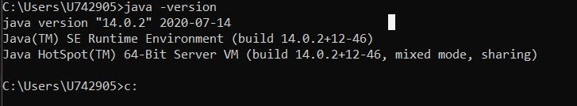
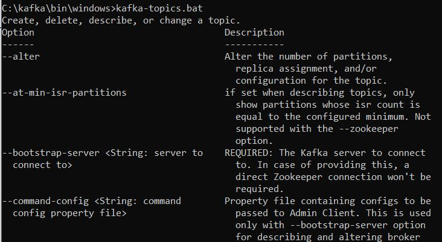
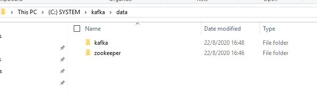
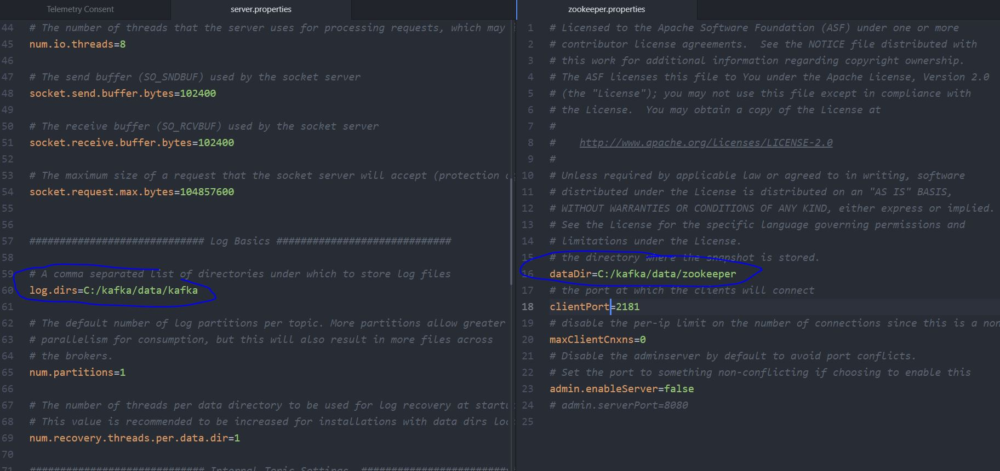
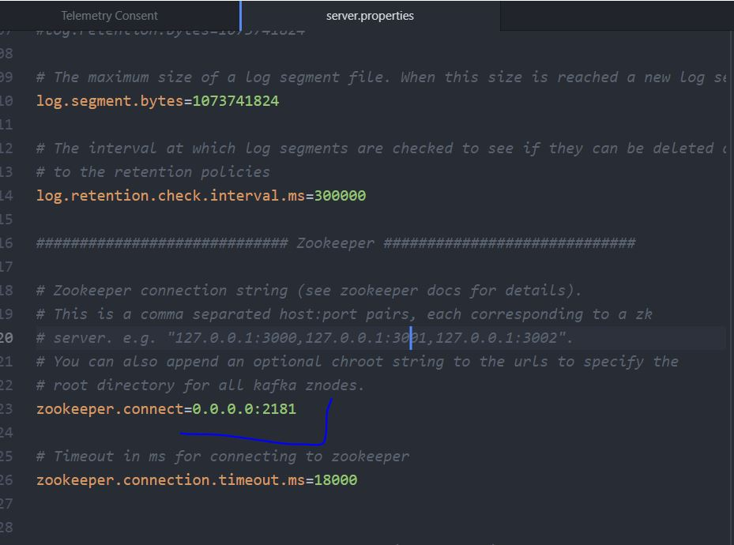

<h2>Apache Kafka for Event Driven Architecture</h2>
In progress...
<h3>Intro</h3>
<ul>
  <li>Data/Event streaming technology.</li>
  <li>Perfect for event driven architecture.</li>
  <li>Kafka is distributed horizontally and redundant (makes copy of all the events) backuping itself in case of failure.</li>
  <li>Kafka needs zookeper to run first.</li>
</ul>
<h3>Installation</h3>
<ol>
  <li>Install Java.</li>
  <li>Add Java to environment variables
      <ul>
        <li>My java directory: C:\Program Files\Java\jdk-14.0.2.</li>
        <li>C:\Program Files\Java\jdk-14.0.2\bin as PATH to User variables.</li>
        <li>C:\Program Files\Java\jdk-14.0.2 as JAVA_HOME to System variables.</li>
      </ul>
  </li>
  <li>We can check if java installation successful:</li>
  
  <li>Install Kafka from https://kafka.apache.org/downloads</li>
  <li>Add Kafka to environment variables
       <ul>
        <li>My kafka directory: C:\kafka\bin\windows.</li>
        <li>C:\kafka\bin\windows as PATH to User variables.</li>
      </ul>
  </li>
  <li>Start Kafka in console:</li>
  
</ol>
<h3>Configuration</h3>
<ol>
  <li>Crete additional folders in Kafka directory:</li>
  
  <li>Edit files: zookeeper.properties and server.properties in kafka/config directory</li>
  
  <li>Edit zookeeper connection string in server.properties:</li>
  
</ol>
