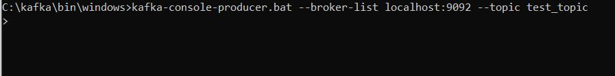

<h2>Apache Kafka for Event Driven Architecture</h2>
<h3>Intro</h3>
<ul>
  <li>Data/Event streaming technology.</li>
  <li>Perfect for event driven architecture.</li>
  <li>Kafka is distributed horizontally and redundant (makes copy of all the events) backuping itself in case of failure.</li>
  <li>Kafka needs zookeper to run first.</li>
</ul>
<h3>Installation</h3>
<ol>
  <li>Install Java.</li>
  <li>Add Java to environment variables
      <ul>
        <li>My java directory: C:\Program Files\Java\jdk-14.0.2.</li>
        <li>C:\Program Files\Java\jdk-14.0.2\bin as PATH to User variables.</li>
        <li>C:\Program Files\Java\jdk-14.0.2 as JAVA_HOME to System variables.</li>
      </ul>
  </li>
  <li>We can check if java installation successful:</li>
  
  <li>Install Kafka from https://kafka.apache.org/downloads</li>
  <li>Add Kafka to environment variables
       <ul>
        <li>My kafka directory: C:\kafka\bin\windows.</li>
        <li>C:\kafka\bin\windows as PATH to User variables.</li>
      </ul>
  </li>
  <li>Start Kafka in console:</li>
  
</ol>
<h3>Configuration</h3>
<ol>
  <li>Crete additional folders in Kafka directory:</li>
  
  <li>Edit files: zookeeper.properties and server.properties in kafka/config directory</li>
  
</ol>
<h3>Running zookeper and kafka</h3>
<ol>
  <li>zookeeper first - runs on localhost:2181   C:\kafka\bin\windows>zookeeper-server-start.bat ../../config/zookeeper.properties   [2020-08-25 14:17:57,974] INFO binding to port 0.0.0.0/0.0.0.0:2181 (org.apache.zookeeper.server.NIOServerCnxnFactory)</li>
  
  <li>kafka second - runs on port 0.0.0.0:9092   C:\kafka\bin\windows>kafka-server-start.bat ../../config/server.properties   once conntecte: [2020-08-25 14:19:03,357] INFO [KafkaServer id=0] started (kafka.server.KafkaServer)</li>
  
</ol>
<h3>Topics on kafka broker</h3>
<ul>
  <li>Creating new one:   C:\kafka\bin\windows>kafka-topics.bat --zookeeper localhost:2181 --topic test2 --create --partitions 1 --replication-factor 1   </li>
  
  <li>Listing all topics:   C:\kafka\bin\windows>kafka-topics.bat --zookeeper localhost:2181 --topic test_topic --describe   </li>
  
</ul>
<h3>Producer</h3>
<ul>
  <li>Producing messages to kafka broker:</li>
  
</ul>
