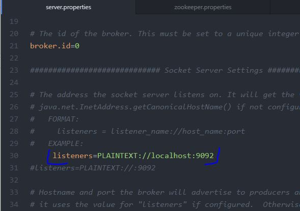
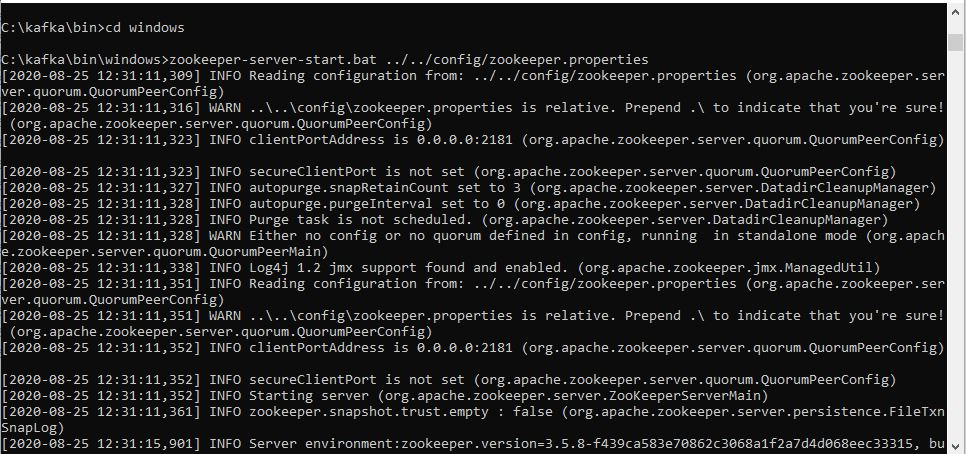
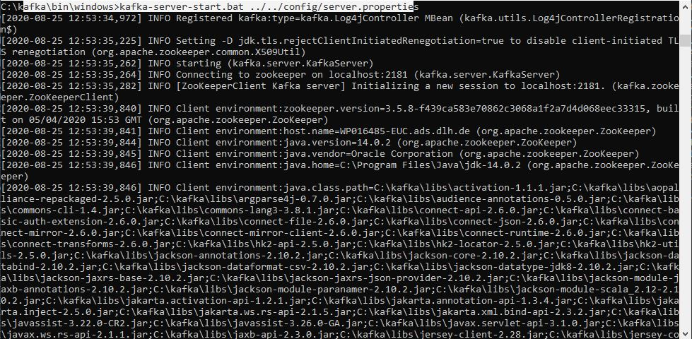
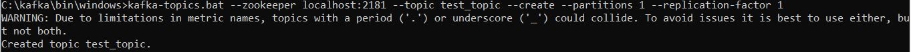
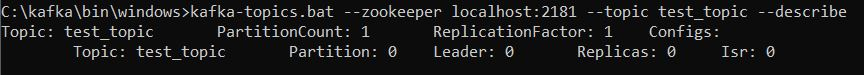
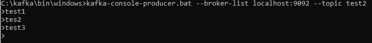
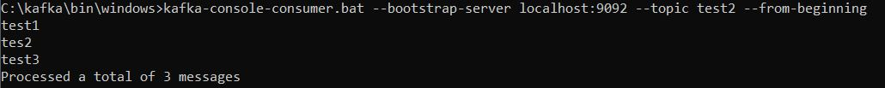
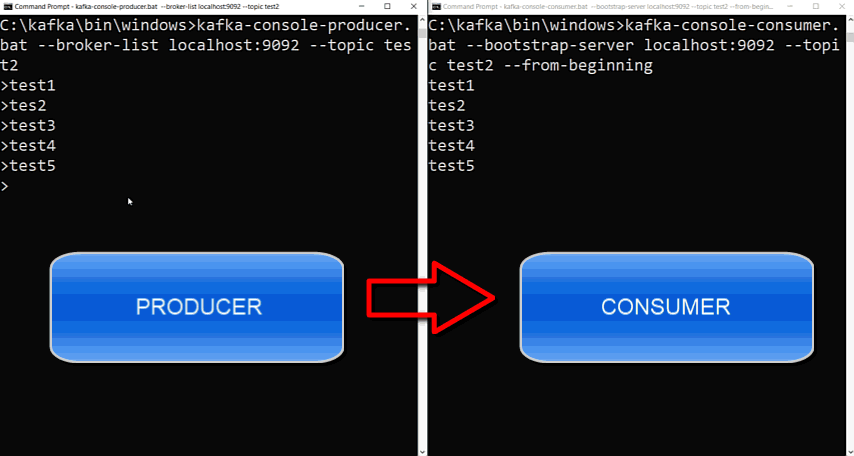
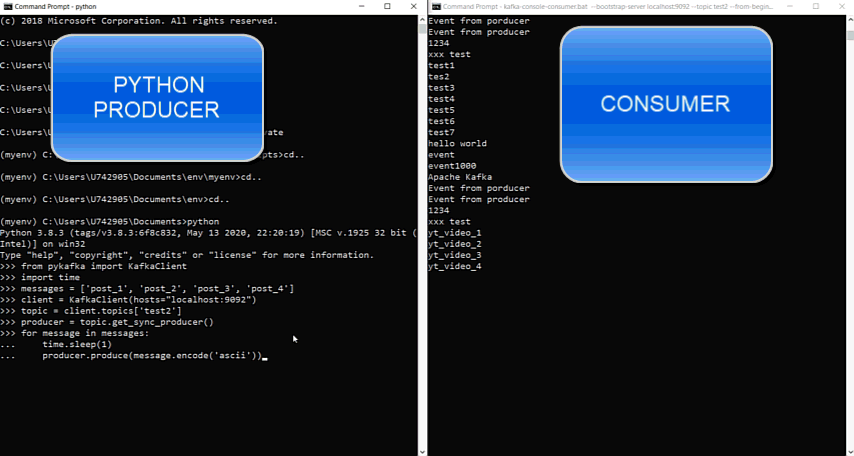

<h2>Apache Kafka for Event Driven Architecture</h2>
<h3>Intro</h3>
<ul>
  <li>Data streaming technology.</li>
  <li>For event driven architecture.</li>
  <li>Kafka is distributed horizontally.</li>
  <li>Kafka is redundant backuping itself up.</li>
  <li>There is need for zookeper to run first.</li>
</ul>
<h3>Installation</h3>
<ol>
  <li>Install Java.</li>
  <li>Add Java to environment variables
      <ul>
        <li>My java directory: C:\Program Files\Java\jdk-14.0.2.</li>
        <li>C:\Program Files\Java\jdk-14.0.2\bin as PATH to User variables.</li>
        <li>C:\Program Files\Java\jdk-14.0.2 as JAVA_HOME to System variables.</li>
      </ul>
  </li>
  <li>We can check if java installation successful:</li>
   
  
  <li>Install Kafka from https://kafka.apache.org/downloads</li>
  <li>Add Kafka to environment variables
       <ul>
        <li>My kafka directory: C:\kafka\bin\windows.</li>
        <li>C:\kafka\bin\windows as PATH to User variables.</li>
      </ul>
  </li>
  <li>Start Kafka in console:</li>
   
  
</ol>
<h3>Configuration</h3>
<ol>
  <li>Crete additional folders in Kafka directory:</li>
   
  
  <li>Edit files: zookeeper.properties and server.properties in kafka/config directory</li>
   
  
  <li>Edit file: server.properties in kafka/config directory</li>
   
  
</ol>
<h3>Running zookeper and kafka</h3>
<ol>
  <li>zookeeper first - runs on localhost:2181  <b>C:\kafka\bin\windows>zookeeper-server-start.bat ../../config/zookeeper.properties   [2020-08-25 14:17:57,974] INFO binding to port 0.0.0.0/0.0.0.0:2181 (org.apache.zookeeper.server.NIOServerCnxnFactory)</b></li>
   
  
  <li>kafka second - runs on localhost:9092  <b>C:\kafka\bin\windows>kafka-server-start.bat ../../config/server.properties   once conntecte: [2020-08-25 14:19:03,357] INFO [KafkaServer id=0] started (kafka.server.KafkaServer)</b></li>
   
  
</ol>
<h3>Topics on kafka broker</h3>
<ul>
  <li>Creating new one:   <b>C:\kafka\bin\windows>kafka-topics.bat --zookeeper localhost:2181 --topic test2 --create --partitions 1 --replication-factor 1 </b> </li>
   
  
  <li>Listing all topics:   <b>C:\kafka\bin\windows>kafka-topics.bat --zookeeper localhost:2181 --topic test_topic --describe </b> </li>
   
  
</ul>
<h3>Kafka Producer</h3>
<ul>
  <li>Producing messages to kafka broker:   <b>C:\kafka\bin\windows>kafka-console-producer.bat --broker-list localhost:9092 --topic test2</b>> </li>
   
  
</ul>
<h3>Kafka Consumer</h3>
<ul>
  <li>Establishing consumer to topic:   <b>C:\kafka\bin\windows>kafka-console-consumer.bat --bootstrap-server localhost:9092 --topic test2 --from-beginning</b>> </li>
   
  
</ul>
<h3>Producer -> Message -> Consumer</h3>
<ul>
  
</ul>
<h3>Python Producer</h3>
<ul>
  <li>Pykafka installation: pip install pykafka.</li>
  <li>Importing: from pykafka import KafkaClient.</li>
  <li>Creating instance of KafkaCleint
    <ul>
      <li>client = KafkaClient(hosts="localhost:9092")</li>
    </ul>
  </li>
   
  
</ul>
<h3>Multiple Python Producers</h3>
<ul>
  <li></li> 
</ul>  
<h3>Python Consumer</h3>
